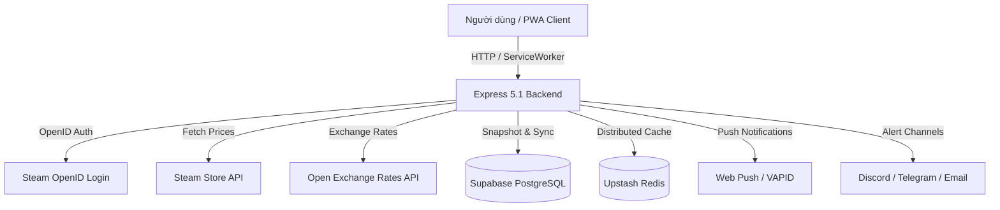

<div align="center">


# Steam Region Price Comparator

**Nền tảng so sánh giá game Steam 27 khu vực, theo dõi mục tiêu & khuyến mãi cá nhân hóa.**

[](https://nodejs.org)
[](https://expressjs.com)
[](https://supabase.com)
[](#-pwa--web-push-notification)
[](#license)

**Tiếng Việt** · [English Documentation](README_EN.md)

---

Công cụ mã nguồn mở cao cấp hỗ trợ so sánh giá game Steam trên **27 quốc gia/khu vực**, quy đổi tỷ giá thời gian thực, đồng bộ đám mây với tài khoản Steam, gửi thông báo Web Push trực tiếp và dự đoán chu kỳ giảm giá.

[🚀 Trải nghiệm trực tiếp](https://steam-region-price.onrender.com) · [🐛 Báo lỗi](https://github.com/vokhoi220808/steam-region-price/issues) · [💡 Đề xuất tính năng](https://github.com/vokhoi220808/steam-region-price/issues)

</div>

---

## 📋 Mục lục

- [Tính năng nổi bật](#-tính-năng-nổi-bật)
- [Cấu trúc kiến trúc & Công nghệ](#-cấu-trúc-kiến-trúc--công-nghệ)
- [Biến môi trường (.env)](#-biến-môi-trường-env)
- [Cấu hình Cơ sở dữ liệu (Supabase)](#-cấu-hình-cơ-sở-dữ-liệu-supabase)
- [Cài đặt & Chạy ứng dụng](#-cài-đặt--chạy-ứng-dụng)
- [Danh sách API System](#-danh-sách-api-system)
- [Hướng dẫn Deploy](#-hướng-dẫn-deploy)
- [Tuyên bố miễn trừ trách nhiệm & Giấy phép](#-tuyên-bố-miễn-trừ-trách-nhiệm--giấy-phép)

---

## ✨ Tính năng nổi bật

### 🔑 1. Đăng nhập Steam & Cloud Sync
- **Xác thực Steam OpenID**: Đăng nhập an toàn, tạo hồ sơ cloud cá nhân mà không lưu mật khẩu.
- **Tự động nhập Wishlist Steam**: Ngay khi đăng nhập, hệ thống tự động tải toàn bộ danh sách ước wishlist từ Steam và đồng bộ vào Cloud.
- **Đồng bộ đa thiết bị**: Mọi game đang theo dõi (Tracker), giá mục tiêu và kênh thông báo (Email, Discord, Telegram, Web Push) được tự động khôi phục khi đổi máy hoặc xóa bộ nhớ trình duyệt.

### ✨ 2. Deal cá nhân hóa ("Deal dành cho bạn")
- **Thuật toán thông minh xếp hạng Deal**:
  - 🎮 **Game trong Wishlist Steam**: `+120 điểm` ưu tiên.
  - 📌 **Game đang theo dõi**: `+90 điểm` ưu tiên.
  - 🎯 **Gần đạt giá mục tiêu (`currentPrice <= 1.15 * targetPrice`)**: `+80 điểm` ưu tiên.
  - 🧩 **DLC/Bundle liên quan đến game đang chơi**: `+70 điểm` ưu tiên.
- **Bộ lọc đa chiều**: Lọc theo **Ngân sách tối đa (Budget filter)**, phần phần trăm giảm giá, điểm đánh giá, thể loại và định dạng nội dung (Game gốc / DLC).

### 📲 3. PWA & Web Push Notification
- **Ứng dụng PWA Native**: Cài đặt ứng dụng trực tiếp lên màn hình chính điện thoại hoặc máy tính desktop chỉ với 1 click.
- **Hỗ trợ Offline Mode**: Trình dịch Service Worker (`sw.js`) lưu cache tĩnh và dữ liệu danh sách Tracker đã xem, cho phép tra cứu ngay cả khi mất mạng.
- **Web Push trực tiếp**: Nhận thông báo trình duyệt real-time ngay khi game giảm đạt mức giá mục tiêu mà không cần ứng dụng chat bên thứ ba.

### 📈 4. Lịch sử giá nội bộ & Dự đoán Sale
- **Snapshot giá Supabase**: Lưu trữ lịch sử biến động giá theo từng khu vực vào cơ sở dữ liệu riêng.
- **Badge so sánh 90 ngày**: Hiển thị tỷ lệ chênh lệch giá hiện tại so với trung bình 90 ngày (`versusAverage90Percent`).
- **Ước tính chu kỳ giảm giá**: Phân tích tần suất và lịch sử các đợt sale quá khứ để đưa ra xác suất khả năng game tiếp tục giảm giá trong tương lai.

### 🛡️ 5. Dashboard Quản trị & Độ tin cậy
- **Trạng thái dịch vụ System Health**: Theo dõi độ trễ (latency ms) và tình trạng hoạt động của **Steam API**, **Supabase**, **Web Push** và **Email**.
- **Quản lý Cron Runs & Retry Queue**: Theo dõi số lượt quét cron, các yêu cầu đẩy thông báo bị lỗi và tự động thực hiện lại (retry với exponential backoff).
- **Rate Limiting & Redis Cache**: Tích hợp Upstash Redis / Memory Fallback giúp hạn chế quá tải API và tối ưu tốc độ phản hồi.

### 🌏 6. Cơ sở dữ liệu Khổng lồ & Tìm kiếm Thông minh
- **Thư viện 3,000+ Games**: Mở rộng kho dữ liệu tự động quét và phân tích hơn 3,000 tựa game hot nhất trên Steam.
- **Bộ lọc Thể loại Nâng cao (OR-Logic)**: Tìm kiếm linh hoạt nhiều thể loại cùng lúc (ví dụ: Action *hoặc* Indie) để khám phá game dễ dàng hơn.
- Tra cứu nhanh bằng Tên, App ID, Package ID hoặc Link Steam.
- Hỗ trợ 27 quốc gia/khu vực và tỷ giá thời gian thực quy đổi trực tiếp về Đồng Việt Nam (VND).

### 🗓️ 7. Lịch Sự Kiện Sale Tương Tác
- **Premium Sale Carousel**: Giao diện Lịch Sự Kiện được thiết kế lại hoàn toàn với phong cách thẻ trượt ngang (Carousel), hiệu ứng Glassmorphism và Gradient cao cấp.
- **Tiến độ Thời gian Thực**: Thanh tiến độ (Progress bar) đếm ngược trực quan từng giây cho các sự kiện đang diễn ra.
- Hiển thị trực tiếp các lễ hội và mùa Sale lớn của Steam để chuẩn bị ngân sách.

---

## 🏗️ Cấu trúc kiến trúc & Công nghệ



### Stack công nghệ

| Tầng | Công nghệ sử dụng |
|---|---|
| **Backend Core** | Node.js (v18+), Express 5.1, ES Modules |
| **Database & Cloud** | Supabase (PostgreSQL), Cloud Alerts Engine |
| **Caching & Rate Limit** | Upstash Redis REST API / In-memory Map fallback |
| **Frontend UI** | Vanilla JS, Modular ES Modules, Custom Design System CSS (~4,500 lines) |
| **PWA & Offline** | Service Worker V7, Web App Manifest, Cache API |
| **Kiểm thử (Testing)** | Native Node Test Runner (`node --test`) |

---

## 📂 Cấu trúc thư mục

```text
steam-region-price/
├── api/                  # Vercel Serverless entrypoints
├── public/               # Frontend Assets & Client Code
│   ├── modules/          # Client ES Modules (account, tracker, storage, services)
│   ├── app.js            # Main application controller
│   ├── index.html        # Main HTML layout
│   ├── style.css         # Application Design System CSS
│   ├── tracker.css       # Price Tracker styling
│   ├── sw.js             # PWA Service Worker & Push Notification Listener
│   └── manifest.webmanifest # PWA Manifest setup
├── server/               # Backend Server Modules
│   ├── account.js        # Steam Auth & Account Sync Router
│   ├── cloud-alerts.js   # Cloud Price Alert Engine & Dispatchers
│   ├── history-store.js  # Price Snapshots & Sale Prediction Engine
│   ├── push.js           # Web Push VAPID Notification Manager
│   └── reliability.js    # Health Monitor, Rate Limiting & Admin Status Router
├── supabase/             # Database Migrations SQL
│   └── migrations/
│       ├── 001_cloud_price_alerts.sql
│       └── 002_accounts_pwa_history_reliability.sql
├── test/                 # Test Suite (node --test)
├── server.js             # Express Server Main Entry point
├── package.json          # Node dependencies & scripts
├── DISCLAIMER.md         # Legal disclaimer
└── README.md             # Project documentation
```

---

## ⚙️ Biến môi trường (.env)

Tạo file `.env` tại thư mục gốc ứng dụng với cấu hình mẫu:

```env
PORT=3000
PUBLIC_BASE_URL=http://localhost:3000
SESSION_SECRET=your_super_secret_session_key_min_32_chars
ADMIN_STEAM_IDS=76561198000000000

# Steam API Key
STEAM_API_KEY=your_steam_api_key

# Supabase Cloud Database (Bắt buộc để chạy Cloud Sync & Alert)
SUPABASE_URL=https://your-project.supabase.co
SUPABASE_SERVICE_ROLE_KEY=your_supabase_service_role_key

# Web Push VAPID Keys
VAPID_PUBLIC_KEY=your_vapid_public_key
VAPID_PRIVATE_KEY=your_vapid_private_key
VAPID_SUBJECT=mailto:admin@example.com

# Redis Caching (Tùy chọn)
UPSTASH_REDIS_REST_URL=https://your-redis.upstash.io
UPSTASH_REDIS_REST_TOKEN=your_upstash_redis_token

# Email Alerts (Resend - Tùy chọn)
RESEND_API_KEY=re_your_resend_api_key
ALERT_FROM_EMAIL=alerts@yourdomain.com

# Cron Job Protection
CRON_SECRET=your_cron_secret_token
```

---

## 🗄️ Cấu hình Cơ sở dữ liệu (Supabase)

Để kích hoạt tính năng Cloud Sync, Lịch sử giá nội bộ và Dashboard quản trị, hãy thực thi các file SQL trong thư mục `supabase/migrations/` trên giao diện **SQL Editor** của dự án Supabase:

1. `001_cloud_price_alerts.sql`: Khởi tạo hệ thống cảnh báo giá và lưu trữ thông báo.
2. `002_accounts_pwa_history_reliability.sql`: Khởi tạo bảng tài khoản `user_accounts`, tracker `cloud_tracker`, `user_wishlist`, `push_subscriptions`, `price_snapshots`, `cron_runs`, `retry_jobs`, `service_health`.

---

## 🛠️ Cài đặt & Chạy ứng dụng

### 1. Tải mã nguồn & Cài đặt gói phụ thuộc
```bash
git clone https://github.com/vokhoi220808/steam-region-price.git
cd steam-region-price
npm install
```

### 2. Chạy môi trường phát triển (Dev Mode)
```bash
npm run dev
```
Ứng dụng sẽ khởi chạy tại: `http://localhost:3000`

### 3. Chạy kiểm thử tự động (Unit Tests)
```bash
node --test
```

---

## 📡 Danh sách API System

| Endpoint | Method | Mô tả |
|---|---|---|
| `/api/auth/steam` | `GET` | Chuyển hướng đăng nhập Steam OpenID |
| `/api/auth/me` | `GET` | Trả về thông tin phiên đăng nhập hiện tại |
| `/api/account/data` | `GET` | Tải dữ liệu tracker cloud và wishlist |
| `/api/account/sync` | `POST` | Đồng bộ dữ liệu local lên cloud |
| `/api/account/wishlist/sync` | `POST` | Kích hoạt tự động nhập Wishlist Steam |
| `/api/account/deals` | `GET` | Tải danh sách deal cá nhân hóa dựa trên Wishlist & Tracker |
| `/api/deals` | `GET` | Tải danh sách top deals theo khu vực (hỗ trợ maxPrice budget filter) |
| `/api/history/internal/:appId` | `GET` | Lấy biểu đồ lịch sử snapshot & dự đoán sale |
| `/api/push/subscribe` | `POST` | Đăng ký nhận thông báo trình duyệt Web Push |
| `/api/health` | `GET` | Kiểm tra tình trạng sức khỏe dịch vụ hệ thống |
| `/api/readiness` | `GET` | Kiểm tra các biến môi trường bắt buộc trước khi đưa production |
| `/api/admin/status` | `GET` | Dashboard quản trị hệ thống (yêu cầu admin) |
| `/api/cron/check-alerts` | `GET/POST` | Endpoint cron tự động quét giá và gửi cảnh báo |

---

## 🚀 Hướng dẫn Deploy

### Deploy trên Vercel

1. Import repository vào Vercel và giữ nguyên cấu hình trong `vercel.json`.
2. Khai báo toàn bộ biến bắt buộc: `PUBLIC_BASE_URL`, `SESSION_SECRET`, `STEAM_API_KEY`, `SUPABASE_URL`, `SUPABASE_SERVICE_ROLE_KEY`, `CRON_SECRET`.
3. Nên cấu hình thêm Upstash Redis, VAPID Web Push và Resend để bật đầy đủ cache và thông báo.
4. Sau khi deploy, mở `/api/readiness`. Chỉ đưa bản build vào sử dụng khi endpoint trả `200` với `status: "ready"`.
5. Kiểm tra một URL `/game/<APP_ID>` để xác nhận OpenGraph động hoạt động khi chia sẻ qua Discord/Facebook.

### Deploy trên Render / Railway / Server riêng
1. Kết nối repository GitHub với nền tảng Cloud của bạn.
2. Cấu hình **Build Command**: `npm install`
3. Cấu hình **Start Command**: `npm start`
4. Khai báo đầy đủ các biến môi trường từ `.env`.

### Cấu hình Cron Job quét giá tự động
Thiết lập cron job 15-30 phút/lần gọi tới endpoint:
```http
POST https://your-domain.com/api/cron/check-alerts
Authorization: Bearer YOUR_CRON_SECRET
```

---

## 📜 Tuyên bố miễn trừ trách nhiệm & Giấy phép

Vui lòng xem chi tiết văn bản pháp lý tại [DISCLAIMER.md](DISCLAIMER.md).

Dự án phát hành theo giấy phép [MIT License](LICENSE). Copyright (c) 2026.
