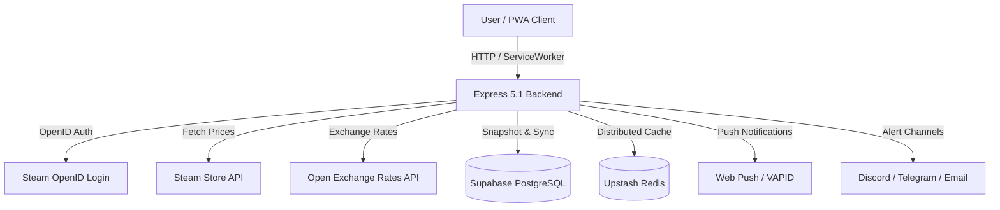

<div align="center">


# Steam Region Price Comparator

**Comprehensive Steam Game Regional Price Comparator, Target Tracker & Personalized Deals Platform.**

[](https://nodejs.org)
[](https://expressjs.com)
[](https://supabase.com)
[](#-pwa--web-push-notifications)
[](#license)

*[Tiếng Việt](README.md) · **English***

---

An advanced open-source web application designed to compare Steam game prices across **27 countries and regions** with real-time currency conversions, Steam OpenID Cloud Sync, browser Web Push Notifications, internal price snapshots, and sale cycle prediction algorithms.

[🚀 Try Live Demo](https://steam-region-price.onrender.com) · [🐛 Report Bug](https://github.com/vokhoi220808/steam-region-price/issues) · [💡 Request Feature](https://github.com/vokhoi220808/steam-region-price/issues)

</div>

---

## 📋 Table of Contents

- [Core Features](#-core-features)
- [Architecture & Tech Stack](#-architecture--tech-stack)
- [Environment Variables (.env)](#-environment-variables-env)
- [Database Setup (Supabase)](#-database-setup-supabase)
- [Installation & Local Run](#-installation--local-run)
- [System API Endpoints](#-system-api-endpoints)
- [Deployment Guide](#-deployment-guide)
- [Disclaimer & License](#-disclaimer--license)

---

## ✨ Core Features

### 🔑 1. Steam Authentication & Cloud Sync
- **Steam OpenID Auth**: Secure passwordless authentication creating a personal cloud profile without storing credentials.
- **Automated Wishlist Import**: Automatically imports and syncs your complete Steam Wishlist upon login.
- **Cross-Device Sync**: Tracked games, target prices, and alert destinations (Email, Discord, Telegram, Web Push) are preserved when changing devices or clearing browser cache.

### ✨ 2. Personalized Deals ("Deals For You")
- **Intelligent Scoring Algorithm**:
  - 🎮 **Steam Wishlist Games**: `+120 priority points`.
  - 📌 **Tracked Games**: `+90 priority points`.
  - 🎯 **Near Target Price (`currentPrice <= 1.15 * targetPrice`)**: `+80 priority points`.
  - 🧩 **Relevant DLCs / Bundles**: `+70 priority points`.
- **Multi-Dimensional Filters**: Filter by **Maximum Budget (Budget filter)**, discount percentage, user rating, game genre, and content type (Base Game / DLC).

### 📲 3. PWA & Web Push Notifications
- **Installable Native PWA**: Install the web app directly onto your mobile home screen or desktop with 1 click.
- **Offline Mode**: Service Worker (`sw.js`) caches static assets and previously viewed Tracker data for offline access.
- **Native Browser Web Push**: Receive real-time push notifications when games reach target prices without requiring third-party messaging apps.

### 📈 4. Internal Price History & Sale Prediction
- **Supabase Price Snapshots**: Stores regional price history snapshots in an isolated database.
- **90-Day Average Comparison Badge**: Highlights the percentage deviation between current price and 90-day average (`versusAverage90Percent`).
- **Sale Cycle Estimation**: Analyzes historical sale frequency to predict the probability of future discounts.

### 🛡️ 5. Reliability & Admin Dashboard
- **System Health Monitor**: Real-time status and latency measurement (ms) for **Steam API**, **Supabase**, **Web Push**, and **Email**.
- **Cron Runs & Retry Queue**: Tracks cron execution metrics, failed notification attempts, and automated retries using exponential backoff.
- **Rate Limiting & Redis Cache**: Integrates Upstash Redis with in-memory fallback to prevent API rate limits and maximize response speed.

### 🌏 6. 27-Region Price Comparison
- Fast lookup by Name, App ID, Package ID, or Steam URL.
- Supports 27 regions: VN, US, UK, EU, JP, KR, CN, BR, MX, CA, AU, IN, ID, PH, TH, SG, MY, TR, ZA, PL, CH, HK, RU, TW, AR, UA, AE.
- Real-time exchange rate conversion to any currency.

---

## 🏗️ Architecture & Tech Stack



### Tech Stack Summary

| Layer | Technology |
|---|---|
| **Backend Core** | Node.js (v18+), Express 5.1, ES Modules |
| **Database & Cloud** | Supabase (PostgreSQL), Cloud Alerts Engine |
| **Caching & Rate Limit** | Upstash Redis REST API / In-memory Map fallback |
| **Frontend UI** | Vanilla JS, Modular ES Modules, Custom Design System CSS (~4,500 lines) |
| **PWA & Offline** | Service Worker V7, Web App Manifest, Cache API |
| **Testing** | Native Node Test Runner (`node --test`) |

---

## 📂 Project Structure

```text
steam-region-price/
├── api/                  # Vercel Serverless entrypoints
├── public/               # Frontend Assets & Client Code
│   ├── modules/          # Client ES Modules (account, tracker, storage, services)
│   ├── app.js            # Main application controller
│   ├── index.html        # Main HTML layout
│   ├── style.css         # Application Design System CSS
│   ├── tracker.css       # Price Tracker styling
│   ├── sw.js             # PWA Service Worker & Push Notification Listener
│   └── manifest.webmanifest # PWA Manifest setup
├── server/               # Backend Server Modules
│   ├── account.js        # Steam Auth & Account Sync Router
│   ├── cloud-alerts.js   # Cloud Price Alert Engine & Dispatchers
│   ├── history-store.js  # Price Snapshots & Sale Prediction Engine
│   ├── push.js           # Web Push VAPID Notification Manager
│   └── reliability.js    # Health Monitor, Rate Limiting & Admin Status Router
├── supabase/             # Database Migrations SQL
│   └── migrations/
│       ├── 001_cloud_price_alerts.sql
│       └── 002_accounts_pwa_history_reliability.sql
├── test/                 # Test Suite (node --test)
├── server.js             # Express Server Main Entry point
├── package.json          # Node dependencies & scripts
├── DISCLAIMER.md         # Legal disclaimer
└── README_EN.md          # Project documentation (English)
```

---

## ⚙️ Environment Variables (.env)

Create a `.env` file in the root directory with the following template:

```env
PORT=3000
PUBLIC_BASE_URL=http://localhost:3000
SESSION_SECRET=your_super_secret_session_key_min_32_chars
ADMIN_STEAM_IDS=76561198000000000

# Steam API Key
STEAM_API_KEY=your_steam_api_key

# Supabase Cloud Database (Required for Cloud Sync & Alerts)
SUPABASE_URL=https://your-project.supabase.co
SUPABASE_SERVICE_ROLE_KEY=your_supabase_service_role_key

# Web Push VAPID Keys
VAPID_PUBLIC_KEY=your_vapid_public_key
VAPID_PRIVATE_KEY=your_vapid_private_key
VAPID_SUBJECT=mailto:admin@example.com

# Redis Caching (Optional)
UPSTASH_REDIS_REST_URL=https://your-redis.upstash.io
UPSTASH_REDIS_REST_TOKEN=your_upstash_redis_token

# Email Alerts (Resend - Optional)
RESEND_API_KEY=re_your_resend_api_key
ALERT_FROM_EMAIL=alerts@yourdomain.com

# Cron Job Protection
CRON_SECRET=your_cron_secret_token
```

---

## 🗄️ Database Setup (Supabase)

To enable Cloud Sync, Internal Price History, and the Reliability Dashboard, execute the SQL migration scripts in `supabase/migrations/` using the **SQL Editor** in your Supabase dashboard:

1. `001_cloud_price_alerts.sql`: Sets up price alert clients, alerts, and event logs.
2. `002_accounts_pwa_history_reliability.sql`: Sets up `user_accounts`, `cloud_tracker`, `user_wishlist`, `push_subscriptions`, `price_snapshots`, `cron_runs`, `retry_jobs`, and `service_health` tables.

---

## 🛠️ Installation & Local Run

### 1. Clone Repository & Install Dependencies
```bash
git clone https://github.com/vokhoi220808/steam-region-price.git
cd steam-region-price
npm install
```

### 2. Run Development Server
```bash
npm run dev
```
The application will be accessible at: `http://localhost:3000`

### 3. Run Automated Tests
```bash
node --test
```

---

## 📡 System API Endpoints

| Endpoint | Method | Description |
|---|---|---|
| `/api/auth/steam` | `GET` | Initiates Steam OpenID authentication redirect |
| `/api/auth/me` | `GET` | Returns current user authentication state |
| `/api/account/data` | `GET` | Fetches user cloud tracker & wishlist data |
| `/api/account/sync` | `POST` | Syncs local tracker data to cloud |
| `/api/account/wishlist/sync` | `POST` | Triggers automated Steam Wishlist import |
| `/api/account/deals` | `GET` | Fetches personalized deals based on Wishlist & Tracker |
| `/api/deals` | `GET` | Fetches top regional deals (supports maxPrice budget filter) |
| `/api/history/internal/:appId` | `GET` | Fetches price history snapshots & sale predictions |
| `/api/push/subscribe` | `POST` | Registers browser Web Push subscription |
| `/api/health` | `GET` | Performs system service health check |
| `/api/admin/status` | `GET` | Admin dashboard analytics & metrics |
| `/api/cron/check-alerts` | `GET/POST` | Automated cron endpoint for checking prices & sending alerts |

---

## 🚀 Deployment Guide

### Deploy on Render / Railway / Custom VPS
1. Connect your GitHub repository to your Cloud Host.
2. Set **Build Command**: `npm install`
3. Set **Start Command**: `npm start`
4. Add all environment variables from `.env`.

### Automated Cron Setup
Configure an external cron service (every 15-30 minutes) to invoke:
```http
POST https://your-domain.com/api/cron/check-alerts
Authorization: Bearer YOUR_CRON_SECRET
```

---

## 📜 Disclaimer & License

Please review our legal disclosure in [DISCLAIMER.md](DISCLAIMER.md).

Released under the [MIT License](LICENSE). Copyright (c) 2026.
